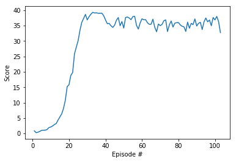

# Report: DDPG for Continuous Control

In this project the DDPG algorithm is implemented to solve the Reacher environment (Twenty agents version). To accomplish the goal, I made a few adjustments to the original DDPG algorithm. In order to get the twenty agents trained, I made a single replay buffer shared across all the agents. Instead of having twenty actor-critic networks, I pass the twenty states coming from the observation vector seen by the anges to a single actor-critic agent. This gets me twenty actions that I pass to the environment. As a result, I get twenty rewards that I use to calculate the average score per episode.

## 1. Architectures
After trying the original architectures and not getting a good result, I decided to change the number of hidden units on both models (actor and critic). The Actor is represented by a neural network composed by:

- Fully connected layer 1: with input = 33 (state spaces) and output = 256
- Fully connected layer 2: with input = 256 and output = 256
- Fully connected layer 3: with input = 256 and output = 4 (for each of the 4 actions)

In the other hand, the Critic neural network is composed by: 

- Fully connected layer 1: with input = 33 (state spaces) and output = 256
- Fully connected layer 2: with input = 256 (states and actions) and output = 256
- Fully connected layer 3: with input = 256 and output = 1 (maps states and actions to Q-values)

## 2. Improvements
Introducing batch normalization layers for the hidden layers was a determinant factor to get some progress. It looks like the agent learnt faster than before. Another key factor to succeed was the implementation of the gradient cliping method when updating the critic. 

## 3. Hyperparameters

Experimentation showed that learning rates had impact on the training progress. I adjusted the original learning rates. The previous ones were LR_Actor = 1e-3, LR_Critic = 1e-4. The new parameters are shown below:

| Parameter              | Value    | 
| -----------------------|:--------:| 
| Replay buffer size     | 1e5      | 
| Batch size             | 128      |  
| Discount factor        | 0.99     |
| LR_Actor               | 2e-4     |
| LR_Critic              | 2e-4     |
| TAU soft update target | 1e-3     |

## 4. Results
The environment takes 103 episodes to be solved!

## 5. Future work
I would like to implement D4PG.

